# MVP — Análise dos óbitos em Salvador (2020–2025)

## Sumário

1. [Introdução](#1-introdução)
2. [Perguntas que serão respondidas](#2-perguntas-que-serão-respondidas)
   - [2.1 Quantidade de óbitos em Salvador](#21-quantidade-de-óbitos-em-salvador)
   - [2.2 Diferenças por faixa etária e sexo](#22-diferenças-por-faixa-etária-e-sexo)
   - [2.3 Comparação entre Salvador e Bahia](#23-comparação-entre-salvador-bahia)
   - [2.4 Evolução dos óbitos entre 2020 e 2025](#24-evolução-dos-óbitos-entre-2020-e-2025)
3. [Bases de dados utilizadas](#3-bases-de-dados-utilizadas)
   - [3.1 SIM](#31-sim)
   - [3.2 CIDs](#32-cids)
   - [3.3 IBGE](#33-ibge)
4. [Ferramentas utilizadas](#4-ferramentas-utilizadas)
5. [Separação e estrutura do conteúdo](#5-separação-e-estrutura-do-conteúdo)
6. [Etapas do desenvolvimento](#6-etapas-do-desenvolvimento)
   - [6.1 00 — Preparação da área de trabalho](#61-00--preparação-da-área-de-trabalho)
   - [6.2 01 — Pré-processamento dos dados](#62-01--pré-processamento-dos-dados)
   - [6.3 02 — Criação das tabelas Bronze](#63-02--criação-das-tabelas-bronze)
   - [6.4 03 — Criação das tabelas Silver](#64-03--criação-das-tabelas-silver)
   - [6.5 04 — Criação das tabelas Gold](#65-04--criação-das-tabelas-gold)
   - [6.6 05 — Respostas das perguntas](#66-05--respostas-das-perguntas)
7. [Resultados obtidos](#7-resultados-obtidos)
   - [7.1 Quantidade de óbitos em Salvador](#71-quantidade-de-óbitos-em-salvador)
   - [7.2 Diferenças por faixa etária e sexo](#72-diferenças-por-faixa-etária-e-sexo)
   - [7.3 Comparação entre Salvador e Bahia](#73-comparação-entre-salvador-e-bahia)
   - [7.4 Evolução dos óbitos entre 2020 e 2025](#74-evolução-dos-óbitos-entre-2020-e-2025)
   - [7.5 Limitações identificadas](#75-limitações-identificadas)
8. [Autoavaliação](#8-autoavaliação)
9. [Melhorias futuras](#9-melhorias-futuras)

---

# 1. Introdução

Este trabalho consiste no desenvolvimento de um MVP (Minimum Viable Product) para análise dos óbitos registrados no município de Salvador, considerando o período de **2020 a 2025**.

O objetivo é construir uma estrutura de dados capaz de integrar informações provenientes de diferentes fontes públicas e, a partir delas, realizar o tratamento, organização e análise dos dados relacionados aos óbitos. O projeto utiliza como principal fonte o **Sistema de Informações sobre Mortalidade (SIM)**, complementado por informações de **Códigos da Classificação Internacional de Doenças (CID)** e dados territoriais do **IBGE**.

A análise foi estruturada seguindo uma arquitetura de dados em camadas (**Raw, Bronze, Silver e Gold**). Essa separação permite organizar o fluxo desde os arquivos obtidos das fontes originais até as tabelas preparadas para responder às perguntas propostas.

O trabalho também busca aplicar, de forma prática, conceitos de engenharia e análise de dados, como ingestão, pré-processamento, qualidade dos dados, normalização, modelagem, integração entre diferentes fontes e criação de dados preparados para análise.

O recorte territorial principal é Salvador, mas a estrutura permite utilizar os dados de municípios e estados para realizar comparações com a Bahia.

---

# 2. Perguntas que serão respondidas

O projeto foi desenvolvido para responder às seguintes perguntas sobre os óbitos registrados entre **2020 e 2025**:

1. **Quantos óbitos foram registrados em Salvador no período de 2020 a 2025 e quais foram as principais causas?**
2. **Como os óbitos se distribuem de acordo com a faixa etária e o sexo das pessoas?**
3. **Como os óbitos registrados em Salvador se comparam aos registrados na Bahia?**
4. **Como o número de óbitos e suas principais causas variaram entre 2020 e 2025?**

Essas perguntas orientam a construção das tabelas da camada Gold e a etapa final de análise. Dessa forma, o tratamento dos dados não é realizado de maneira isolada: cada transformação busca preservar e disponibilizar as informações necessárias para responder aos objetivos definidos.

## 2.1 Quantidade de óbitos em Salvador

A primeira pergunta busca identificar a quantidade de óbitos registrados em Salvador durante o período analisado e entender quais foram as principais causas básicas de morte.

Essa análise é relevante porque estabelece uma visão geral da mortalidade no município. Além da quantidade total de registros, a identificação das principais causas permite compreender quais grupos de doenças ou condições concentram maior número de óbitos e servirá como base para as demais análises.

## 2.2 Diferenças por faixa etária e sexo

A segunda pergunta busca verificar como os óbitos se distribuem entre diferentes faixas etárias e entre os sexos.

Essa segmentação permite observar se determinadas causas estão mais presentes em grupos específicos da população. Para isso, a idade será calculada a partir das datas de nascimento e óbito e posteriormente agrupada em faixas etárias.

As faixas utilizadas serão:

- Menores de 1 ano;
- De 1 ano até 17 anos;
- De 18 anos até 59 anos;
- De 60 anos até 79 anos;
- Maiores de 80 anos;
- Sem informação de idade.

A categoria **"Sem informação de idade"** será utilizada para os registros em que não for possível obter a idade devido à ausência da data de nascimento.

## 2.3 Comparação entre Salvador e Bahia

A terceira pergunta busca contextualizar os dados de Salvador por meio da comparação com outras escalas territoriais.

A utilização dos dados de municípios e estados permite relacionar os registros do SIM com a divisão territorial e identificar o município e o estado associados a cada registro.

Essa análise é relevante porque a quantidade de óbitos de um município, isoladamente, não permite compreender seu contexto territorial. A comparação com a Bahia amplia a análise e permite observar diferenças na distribuição dos registros entre os diferentes níveis geográficos.

## 2.4 Evolução dos óbitos entre 2020 e 2025

A quarta pergunta busca analisar a evolução dos óbitos ao longo dos seis anos do período definido.

A análise temporal permite identificar variações na quantidade de registros e nas principais causas de morte ao longo dos anos. Essa perspectiva também possibilita verificar se determinados padrões permaneceram estáveis ou se apresentaram mudanças durante o período analisado.

---

# 3. Bases de dados utilizadas

O projeto utiliza três fontes principais de dados:

- **SIM — Sistema de Informações sobre Mortalidade**;
- **CIDs — Classificação Internacional de Doenças**;
- **IBGE — informações territoriais de municípios e estados**.

As três fontes possuem funções diferentes dentro do projeto. O SIM fornece os registros de óbitos, a base de CIDs permite interpretar e organizar os códigos das causas de morte e a base do IBGE fornece informações territoriais para identificar municípios e estados.

## 3.1 SIM

O **Sistema de Informações sobre Mortalidade (SIM)** é utilizado como principal fonte de dados do projeto. Ele contém registros relacionados aos óbitos e reúne diversas informações presentes nas declarações de óbito. Para este trabalho, os dados do SIM foram obtidos por meio da biblioteca **microdatasus**, utilizada no ambiente R para acesso e processamento de dados públicos de saúde.


Mais informações sobre a biblioteca **microdatasus** pode ser obtida clicando [aqui](https://github.com/rfsaldanha/microdatasus)  

O dícionário completo do **SIM** pode ser obtido clicando [aqui](https://svs.aids.gov.br/daent/cgiae/coesv/sistemas-informacao/sim/documentacao/dicionario-de-dados-SIM-tabela-DO.pdf)

## 3.2 CIDs

A base da **Classificação Internacional de Doenças - CID** é utilizada para complementar os registros do SIM, principalmente na interpretação e organização das causas básicas de óbito.  

O **CID** é o sistema global padronizado pela OMS para registrar e estatisticamente categorizar diagnósticos, sintomas e causas de morte. O CID-10 é a décima revisão desse sistema, e classifica os códigos em alfanuméricos e os agrupam em 22 capítulos temáticos. Estes capítulos cobrem desde infecções, transtornos mentais e neoplasias até lesões, causas externas e condições específicas por sistemas do corpo humano.

Os códigos de causa presentes no SIM são códigos relacionados à Classificação Internacional de Doenças. Dessa forma, uma tabela de referência é necessária para relacionar os códigos existentes nos registros de mortalidade às suas respectivas classificações.

A fonte original utilizada no projeto é uma planilha contendo os códigos e informações da classificação de doenças. Essa planilha passa pelo pré-processamento antes de ser disponibilizada no ambiente Databricks.

Esta planilha foi obtida através do site do Ministério da Previdência Social. Para acessar a página basta clicar [aqui](https://www.gov.br/previdencia/pt-br/assuntos/previdencia-social/saude-e-seguranca-do-trabalhador/acidente_trabalho_incapacidade/tabelas-cid-10)

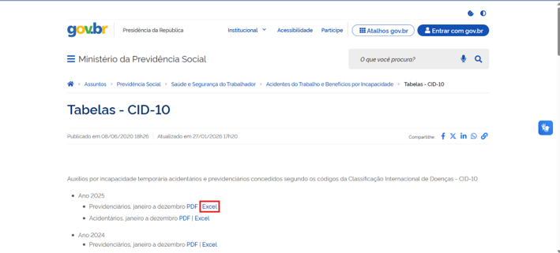

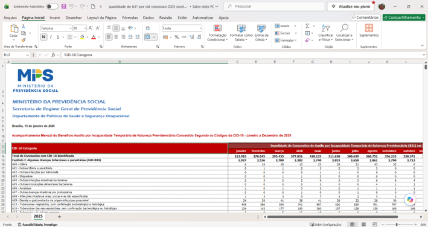

## 3.3 IBGE

A base do **IBGE** é utilizada para fornecer informações territoriais dos municípios e estados brasileiros.

A fonte utilizada no projeto é uma planilha contendo informações de identificação dos municípios, que é tratada durante a etapa de pré-processamento antes de ser carregada no Databricks.

A utilização dessa base é necessária porque os registros do SIM possuem códigos de municípios, enquanto as análises precisam associar esses códigos aos respectivos nomes e estados.

A planilha utilizada foi extraída do próprio site do IBGE, e pode ser acessada clicando [aqui](https://www.ibge.gov.br/explica/codigos-dos-municipios.php)

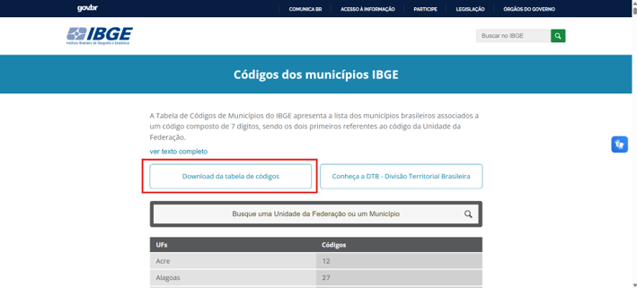

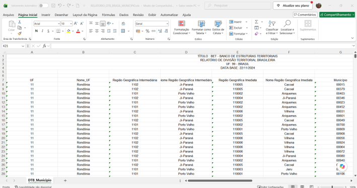

---

# 4. Ferramentas utilizadas

O projeto utiliza diferentes ferramentas em etapas específicas do desenvolvimento.

### Databricks

O **Databricks** é o ambiente principal utilizado para armazenamento, organização e processamento dos dados.

Nele são criados o workspace, catalog, schemas, volumes, tabelas e notebooks responsáveis pelas diferentes etapas do projeto.

Os notebooks utilizam principalmente **Python e SQL**.

### VS Code

O **Visual Studio Code (VS Code)** foi utilizado nas etapas realizadas externamente ao Databricks, principalmente para desenvolvimento e execução dos scripts de pré-processamento em Python.

### RStudio

O **RStudio** foi utilizado para obtenção e processamento inicial dos dados do SIM por meio da biblioteca `microdatasus`.

A utilização do R nessa etapa está relacionada especificamente à obtenção e preparação dos dados públicos de saúde antes de sua disponibilização no ambiente Databricks.

### Python

Python é utilizado tanto no pré-processamento externo quanto nas etapas de tratamento e análise realizadas nos notebooks do Databricks.

### SQL

SQL é utilizado nos notebooks do Databricks para criação, transformação e organização das tabelas.

### IAs Generativas (Claude, Chat Gpt, Gemini)

Foi utilizado a Ia para auxílio dá elaboração, melhoramento e correção dos códigos e dos relátorios deste trabalho. Parte da análise foi realizada com Pandas, e posteriormente foi transcrito para a lingugem spark para rodar no databricks.

### Git e Github

Para o versionamento do código e seu compartilhamento foram utilizados o Git e o Github.

---

# 5. Separação e estrutura do conteúdo

O projeto foi organizado dentro de um **Workspace no Databricks**, no qual foram criados notebooks responsáveis por cada etapa do desenvolvimento.

A estrutura de armazenamento foi organizada através da criação de um **Catalog** e de schemas **Raw**,**Bronze**,**Silver**, **Gold**. Além dos schemas, foram criados três volumes:

1. **Volume de imagens** — destinado ao armazenamento de imagens utilizadas no projeto;
2. **Volume de fontes de dados originais** — destinado aos arquivos obtidos diretamente das fontes;
3. **Volume de fontes de dados brutos** — destinado aos arquivos após o pré-processamento externo e que serão utilizados na camada Raw.

A arquitetura segue o fluxo geral:

```text
Fontes originais
       |
       v
Pré-processamento externo
(Python / R)
       |
       v
Volume de dados brutos
       |
       v
     RAW
       |
       v
    BRONZE
       |
       v
     SILVER
       |
       v
      GOLD
       |
       v
Respostas das perguntas
```

A ingestão dos arquivos nos volumes foi realizada manualmente por meio do recurso **Data Ingestion** do Databricks.

A separação em camadas permite diferenciar os dados conforme seu nível de tratamento e finalidade, facilitando a organização, rastreabilidade e manutenção do projeto.

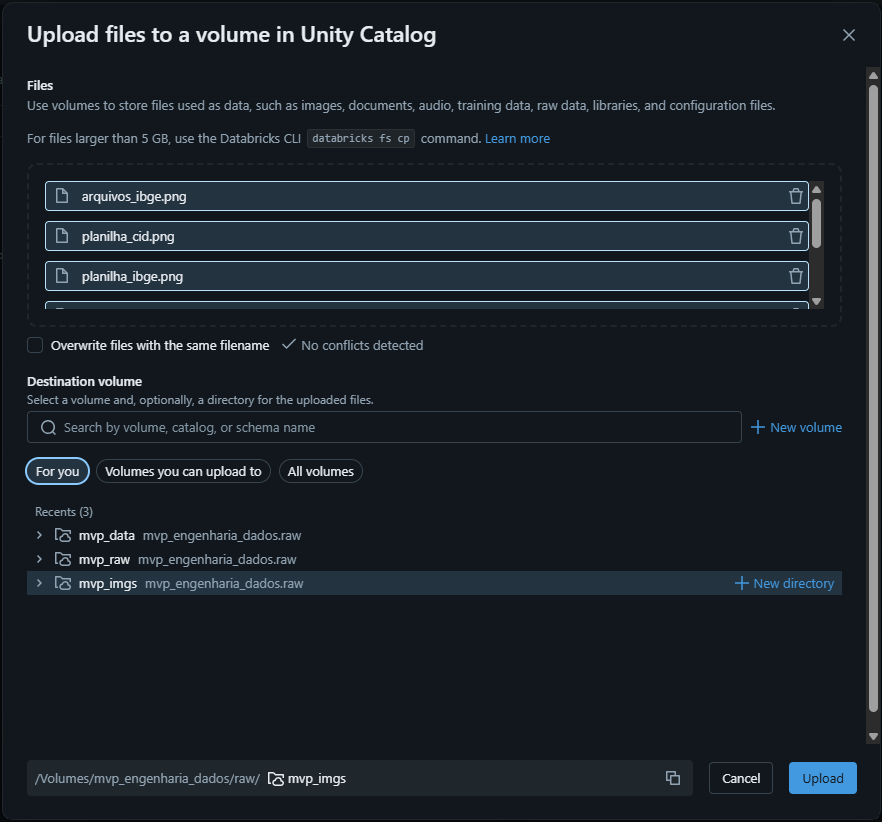

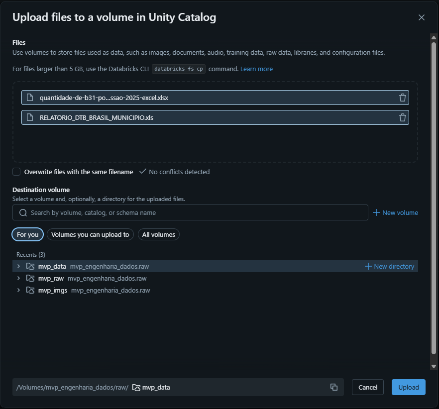

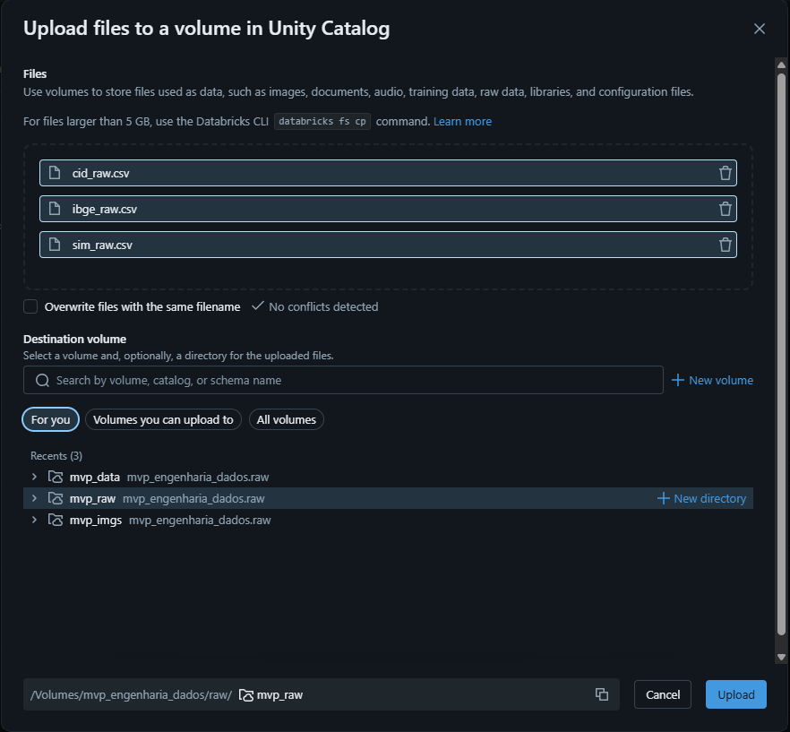

---

# 6. Etapas do desenvolvimento

O projeto foi dividido em 6 etapas, e cada uma delas está representada em um notebook do workspace do databricks. Mais detalhes e os códigos de cadda etapa podem ser vistos acessando o notebook correspondente.

## 6.1 00 — Preparação da área de trabalho

A primeira etapa consiste na preparação da estrutura que será utilizada durante todo o desenvolvimento.

Nesse notebook são criados:

- o **Catalog**;
- os **Schemas** `raw`, `bronze`, `silver` e `gold`;
- os três **Volumes** necessários ao projeto.

Essa etapa é importante porque estabelece a estrutura lógica e física do ambiente antes que os dados sejam carregados.

A organização em schemas permite separar os dados de acordo com seu estágio de processamento, enquanto os volumes permitem armazenar os arquivos utilizados no projeto. Essa preparação também facilita a manutenção do ambiente, pois cada etapa possui um local definido e pode ser identificada de acordo com sua finalidade.

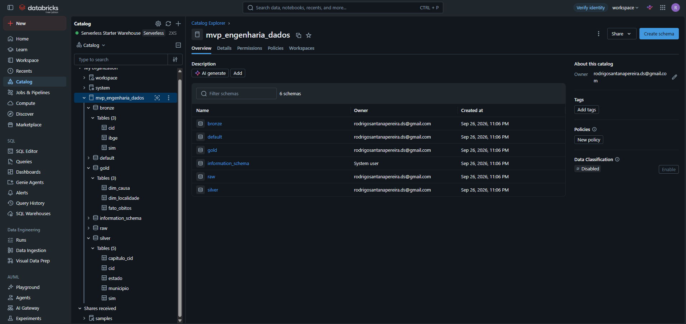

---

## 6.2 01 — Pré-processamento dos dados

O pré-processamento é realizado **fora do ambiente Databricks**, utilizando Python e R.

O objetivo dessa etapa é preparar os arquivos originais para que possam ser utilizados posteriormente pelas tabelas do Databricks.

As fontes originais utilizadas são:

- uma planilha Excel contendo os dados de **CIDs**;
- uma planilha Excel contendo os dados do **IBGE**;
- os dados do **SIM**, obtidos por meio da biblioteca `microdatasus` no R.

Após o carregamento das fontes, são realizados tratamentos iniciais de limpeza e mineração. Esses tratamentos têm como objetivo adequar os dados ao formato necessário para sua utilização no Databricks.Ao final do processo, são gerados três arquivos CSV:

- arquivo de CIDs;
- arquivo do SIM;
- arquivo do IBGE.

Esses arquivos representam os **dados brutos preparados para a ingestão**, sendo utilizados como a camada Raw. As planilhas originais e os arquivos CSV resultantes são armazenados nos volumes correspondentes criados no Databricks.

É importante destacar que esse pré-processamento externo não corresponde ao tratamento analítico completo da camada Silver. Ele tem como objetivo principal preparar tecnicamente os arquivos para que possam ser ingeridos e processados no ambiente.

---

## 6.3 02 — Criação das tabelas Bronze

Nesta etapa são lidos os arquivos CSV armazenados no volume de dados brutos e são criadas três tabelas na camada Bronze:

- `CID`;
- `SIM`;
- `IBGE`.

A camada Bronze representa uma etapa em que os dados ainda mantêm, de maneira geral, a estrutura dos dados recebidos na camada Raw. Dessa forma, a Bronze funciona como uma representação estruturada dos dados brutos dentro do ambiente de processamento. A principal finalidade dessa camada é preservar os dados de entrada em formato de tabela antes da realização dos tratamentos e transformações mais significativos da camada Silver.

### Imagens

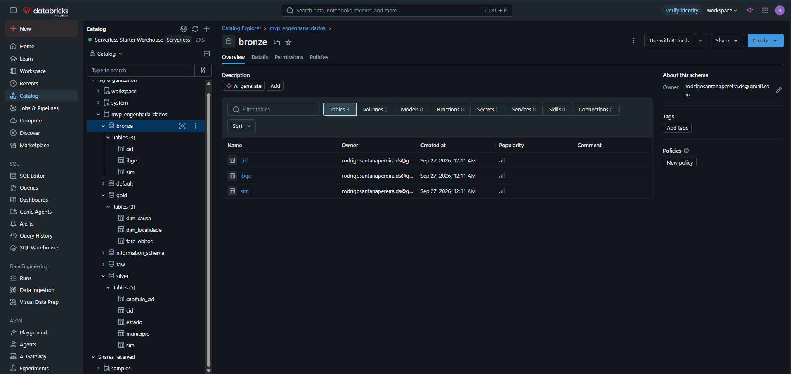

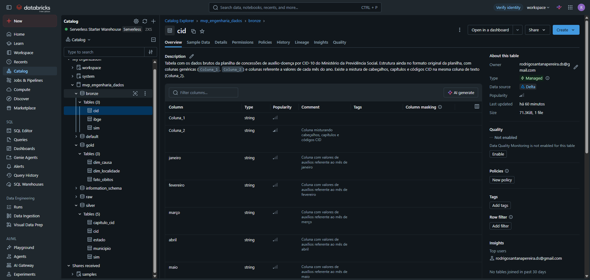

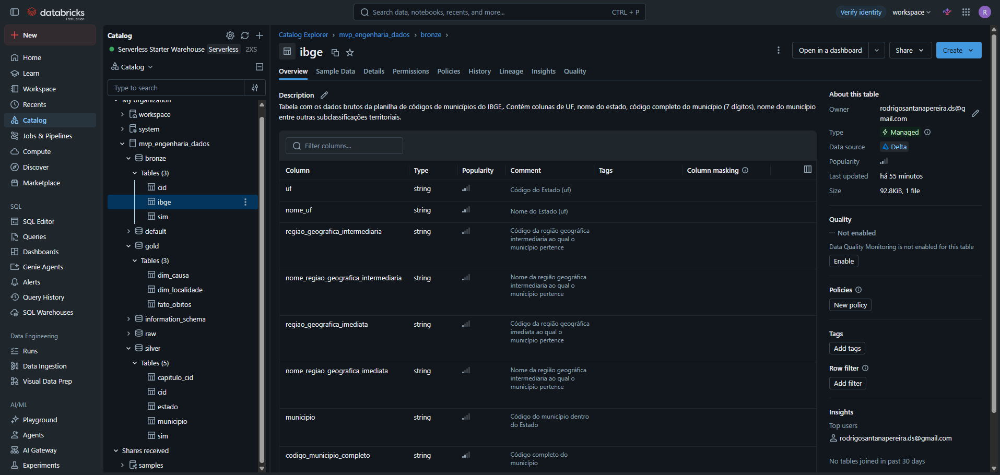

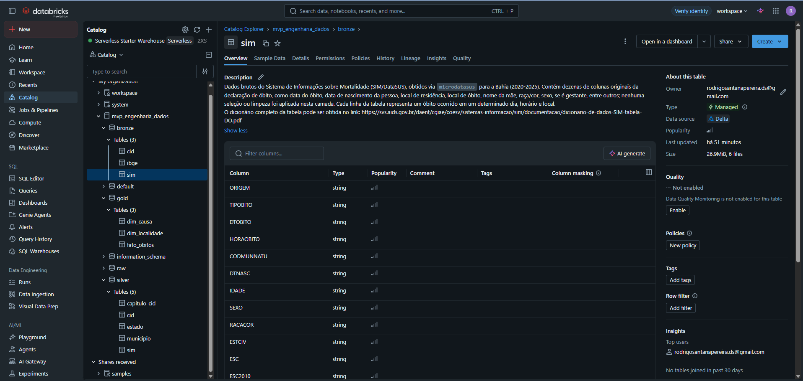

---

## 6.4 03 — Criação das tabelas Silver

A camada Silver é responsável pelo principal processo de limpeza, análise e transformação dos dados dentro do Databricks. Nesta etapa são realizadas análises exploratórias das três tabelas Bronze e aplicados tratamentos necessários para melhorar a qualidade e a organização dos dados.

Entre os tratamentos realizados estão:

- identificação e remoção de duplicidades;
- tratamento de campos vazios;
- identificação e tratamento de dados inconsistentes;
- remoção de informações que não possuem relevância para o objetivo do MVP;
- criação de novas colunas;
- padronização dos dados;
- organização das relações entre as tabelas.

Ao final da etapa, as três tabelas de origem dão origem a **cinco tabelas Silver**.

### Origem: CID

Durante a etapa Silver, tabela de CID dá origem a duas tabelas:

- **`CAPITULOS`** — contendo os capítulos da classificação;
- **`CID`** — contendo os códigos de CID e seu relacionamento com o respectivo capítulo.

Essa separação facilita a utilização das informações de classificação nas análises posteriores e evita a repetição de informações de capítulo em cada registro de código CID.


### Origem: IBGE

A tabela de IBGE dá origem a:

- **`ESTADO`** — contendo os códigos e nomes dos estados;
- **`MUNICIPIO`** — contendo os códigos e nomes dos municípios e o relacionamento com o estado correspondente.

Também é criada na tabela de municípios a coluna `CODIGO_MUNICIPIO_SAUDE`. Essa coluna é necessária porque o código de município utilizado na base de saúde possui **6 dígitos**, enquanto o código de município utilizado na referência do IBGE possui **7 dígitos**. O código utilizado na saúde corresponde ao código do município do IBGE sem o último dígito.

A criação dessa informação facilita o relacionamento entre os registros do SIM e a tabela de municípios.

### Origem: SIM

A tabela `SIM` é mantida como uma tabela única, porém passa por limpeza, seleção de campos, criação de novas colunas e tratamentos necessários para as análises. Ressalta-se ainda que a base original do SIM possui uma quantidade elevada de campos. Como o objetivo deste MVP é responder perguntas específicas sobre mortalidade em Salvador, não se entendeu necessário a realização o tratamento completo de todas as colunas disponíveis. Por esse motivo, foram selecionadas as colunas consideradas relevantes para as análises, sendo elas:

| Campo | Descrição |
|---|---|
| `TIPOBITO` | Tipo do óbito, indicando se é fetal ou não fetal |
| `DTOBITO` | Data do óbito |
| `HORAOBITO` | Hora do óbito |
| `DTNASC` | Data de nascimento |
| `SEXO` | Sexo da pessoa que veio a óbito |
| `CODMUNRES` | Código do município de residência da pessoa que veio a óbito |
| `CODMUNOCOR` | Código do município onde ocorreu o óbito |
| `CAUSABAS` | Causa básica do óbito |

A escolha dessas colunas representa um recorte do SIM direcionado especificamente às perguntas deste MVP. O objetivo é reduzir a complexidade do processamento sem eliminar as informações necessárias para as análises propostas.

Além da seleção de apenas algumas colunas, forma adotadas algumas considerações no tratamento:

- A `HORAOBITO` será utilizada como informação auxiliar na verificação de possíveis duplicidades;
- Embora exista informação de idade na base original, a idade utilizada no projeto será calculada a partir da diferença entre a data de nascimento e a data do óbito;
- Será considerada somente a **causa básica do óbito**, sem utilização das demais linhas de causas disponíveis para outros tipos de análise;
- Registros em que a data do óbito seja anterior à data de nascimento serão excluídos, pois não é possível determinar qual das informações está incorreta;
- Quando não houver data de nascimento, a idade será considerada nula;
- A partir da idade será criada a coluna `FAIXA_ETARIA`, seguindo a classificação definida anteriormente.

A coluna `FAIXA_ETARIA`, será criada utilizando as seguintes categorias:

| Faixa | Critério |
|---|---|
| Menores de 1 ano | idade inferior a 1 ano |
| De 1 ano até 17 anos | idade de 1 a 17 anos |
| De 18 anos até 59 anos | idade de 18 a 59 anos |
| De 60 anos até 79 anos | idade de 60 a 79 anos |
| Maiores de 80 anos | idade superior a 80 anos |
| Sem informação de idade | idade nula |

### Imagens


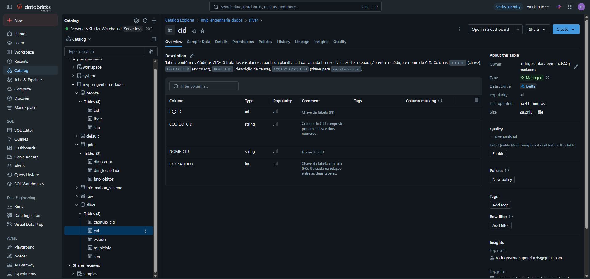

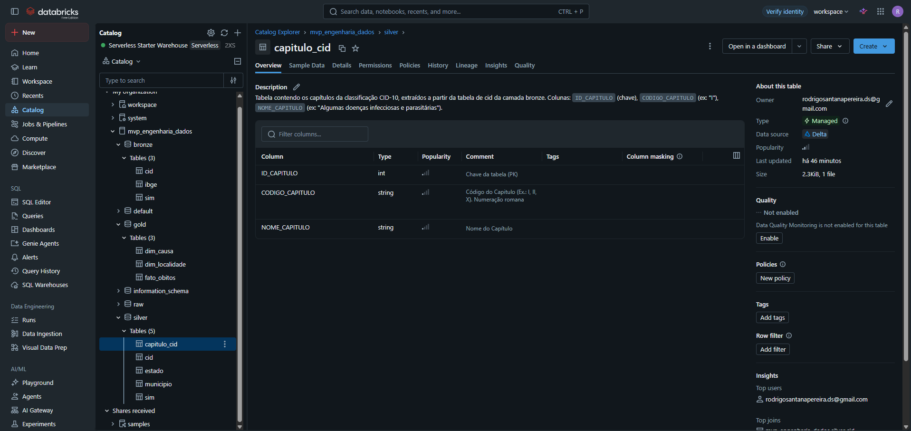

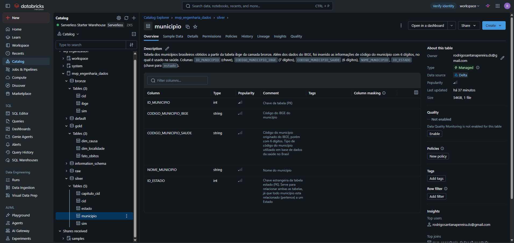

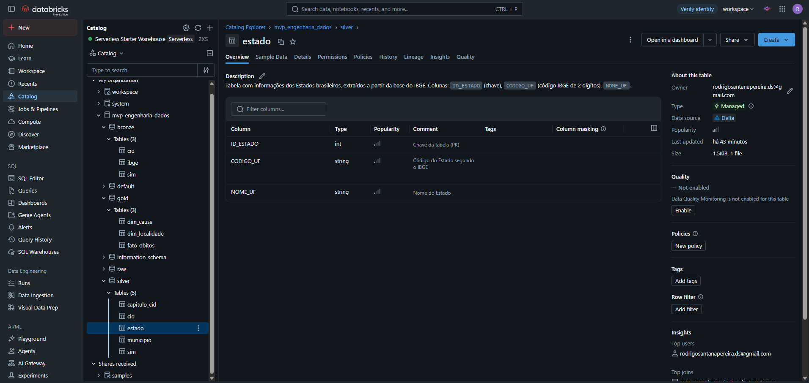

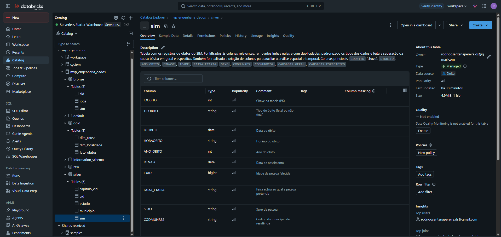

---

## 6.5 04 — Criação das tabelas Gold

A camada Gold tem como objetivo transformar os dados tratados na camada Silver em uma estrutura otimizada para responder às perguntas de negócio do MVP. Diferente da Silver, que organiza e garante a qualidade dos dados, a Gold é modelada pensando diretamente no consumo analítico.

Para isso, foi adotado um **Esquema Estrela (Star Schema)**, composto por uma tabela fato central e tabelas dimensão que descrevem o contexto de cada óbito:

- **`fato_obitos`**: tabela fato, contendo um registro por óbito (grão = 1 óbito), com as chaves para as dimensões e os atributos necessários para as análises (`ANO_OBITO`, `SEXO`, `FAIXA_ETARIA`);
- **`dim_localidade`**: tabela dimensão com os municípios e estados (construída a partir de `silver.municipio` + `silver.estado`), permitindo identificar e comparar diferentes localidades (Salvador, Bahia);
- **`dim_causa`**: tabela dimensão com os códigos CID-10 e seus respectivos capítulos (construída a partir de `silver.cid` + `silver.capitulo_cid`), permitindo identificar e agrupar as causas de óbito.

### Processo de construção

As dimensões `dim_localidade` e `dim_causa` são construídas a partir das tabelas já tratadas na camada Silver, unificando as informações relacionadas (município+estado, e CID+capítulo) em uma única tabela por tema.

A tabela `fato_obitos` é construída a partir da `silver.sim`, relacionando cada óbito à sua localidade de residência (`CODMUNRES` → `CODIGO_MUNICIPIO_SAUDE`) e à sua causa básica (`CAUSABAS_GERAL` → `CODIGO_CID`). Durante essa construção, foi feita uma verificação de integridade referencial, que identificou registros sem correspondência em ambas as dimensões (detalhado na seção [7.5 Limitações identificadas](#75-limitações-identificadas)). Para que esses registros não fossem silenciosamente descartados das análises, foi adicionado um registro **"Não identificado"** em cada dimensão, e os registros sem correspondência foram associados a ele em vez de ficarem nulos.

### Estrutura das tabelas

| Tabela | Campo | Descrição |
|---|---|---|
| `fato_obitos` | `IDOBITO` | Identificador único do óbito |
| `fato_obitos` | `ANO_OBITO` | Ano de ocorrência do óbito |
| `fato_obitos` | `SEXO` | Sexo da pessoa falecida (Masculino, Feminino, Não informado, NA¹) |
| `fato_obitos` | `FAIXA_ETARIA` | Faixa etária calculada na Silver |
| `fato_obitos` | `ID_MUNICIPIO_RESIDENCIA` | Chave para `dim_localidade` |
| `fato_obitos` | `ID_CAUSA` | Chave para `dim_causa` |
| `dim_localidade` | `ID_MUNICIPIO` | Identificador do município |
| `dim_localidade` | `NOME_MUNICIPIO` / `NOME_UF` | Nome do município e do estado |
| `dim_localidade` | `FLAG_SALVADOR` | Indica se o registro corresponde ao município de Salvador |
| `dim_causa` | `ID_CID` | Identificador do código CID |
| `dim_causa` | `CODIGO_CID` / `NOME_CID` | Código e nome da causa |
| `dim_causa` | `NOME_CAPITULO` | Capítulo do CID-10 correspondente |

¹ Ver seção 7.5 sobre o registro "NA" identificado na coluna `SEXO`.

### Imagens

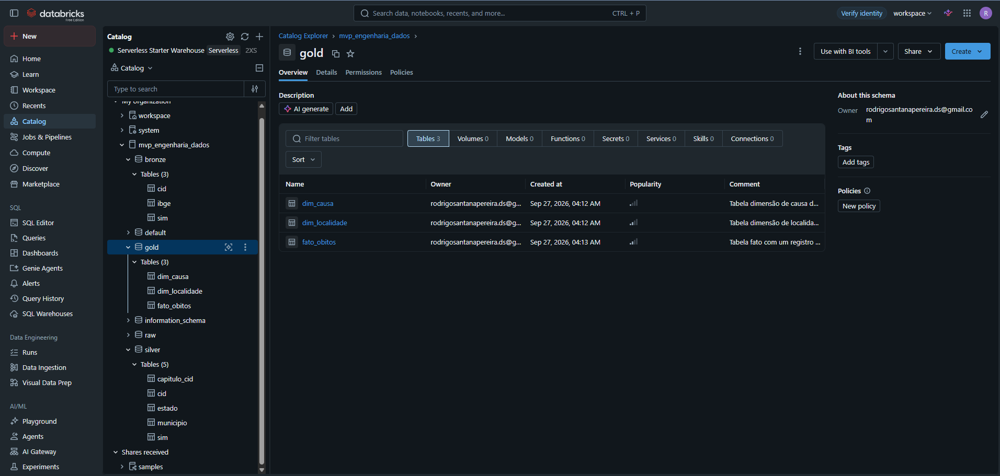

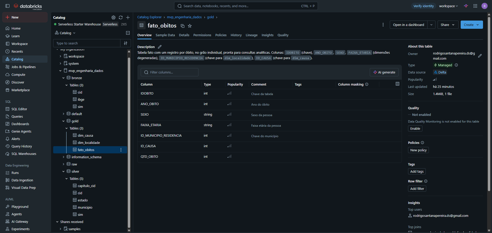

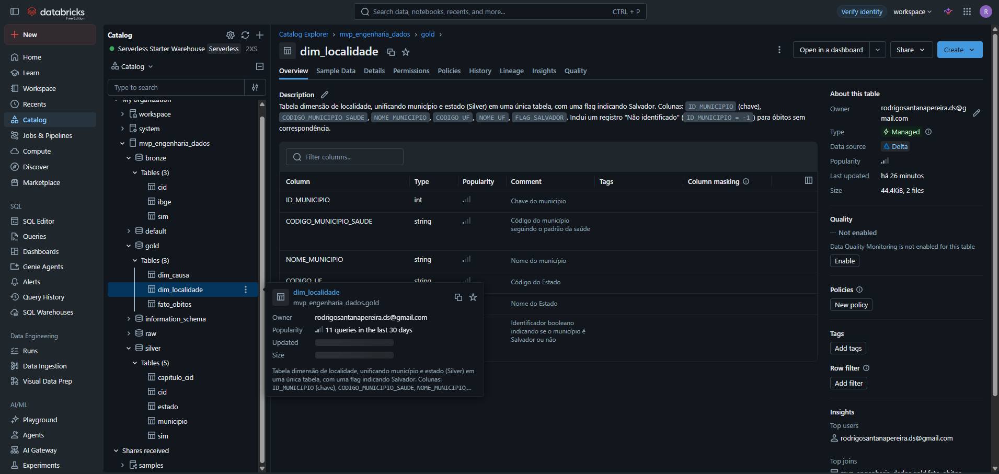

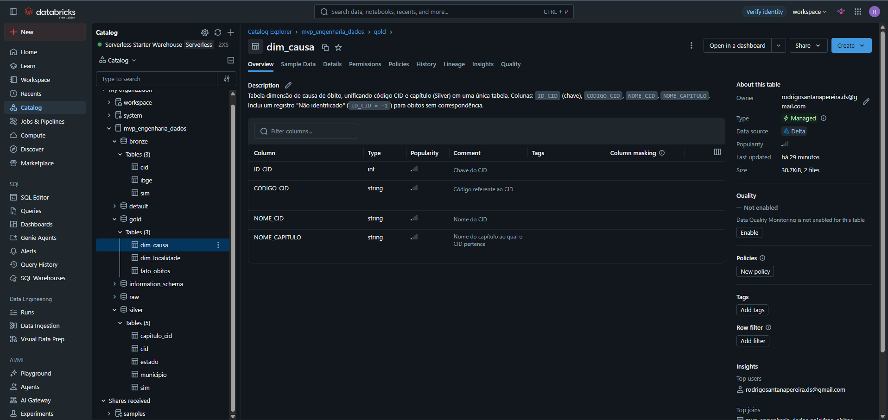


---

## 6.6 05 — Respostas das perguntas

Com as tabelas Gold criadas, este notebook responde às quatro perguntas definidas no início do projeto por meio de consultas SQL diretamente sobre `fato_obitos`, `dim_localidade` e `dim_causa`. Foram executadas oito consultas, cobrindo: total de óbitos e principais causas em Salvador; distribuição por sexo e por faixa etária (incluindo o cruzamento entre as duas); comparação entre Salvador e os demais municípios da Bahia; e a evolução anual dos óbitos e das principais causas entre 2020 e 2025. Os resultados de cada consulta são apresentados e discutidos na seção seguinte.

---

# 7. Resultados obtidos

## 7.1 Quantidade de óbitos em Salvador

Entre 2020 e 2025, foram registrados **118.933 óbitos** de residentes em Salvador.

As principais causas básicas de óbito identificadas foram:

| Código CID | Causa | Óbitos | 
|---|---|---|
| B34 | Doenças por vírus, de localização não especificada | 9.998 |
| X95 | Agressão por disparo de arma de fogo ou arma não especificada | 5.481 |
| I21 | Infarto agudo do miocárdio | 4.950 |
| R99 | Outras causas mal definidas e não especificadas de mortalidade | 4.365 |
| E14 | Diabetes mellitus não especificado | 3.439 |
| J18 | Pneumonia por microorganismo não especificado | 2.733 |
| I64 | AVC não especificado como hemorrágico ou isquêmico | 2.459 |
| G30 | Doença de Alzheimer | 2.249 | 
| C50 | Neoplasia maligna da mama | 2.214 | 

*(além de 3.445 óbitos classificados como "Não identificado"; ver seção 7.5)*

O resultado chama atenção para dois pontos: **B34** aparece como a causa mais frequente, concentrada principalmente em 2020 e 2021 (ver seção 7.4), o que pode seer reflexo da pandemia. Já **X95** (agressão por arma de fogo), em segundo lugar, evidencia o peso das causas externas violentas na mortalidade da cidade. destaque ainda para um elevado valor de óbitos por causas naturais como infarto (I21) e diabetes (E14).

## 7.2 Diferenças por faixa etária e sexo

**Por sexo:**

| Sexo | Óbitos |
|---|---|
| Masculino | 62.868 |
| Feminino | 56.023 |
| Não identificado (NA) | 42 |

Óbitos de homens superam os de mulheres em Salvador no período (diferença de aproximadamente 6600 óbitos).

**Por faixa etária:**

| Faixa etária | Óbitos | 
|---|---|
| De 60 a 79 anos | 45.605 | 
| De 18 a 59 anos | 35.682 | 
| Maiores de 80 anos | 33.629 | 
| Menores de 1 ano | 2.453 | 
| De 1 a 17 anos | 1.564 | 

Como esperado, a mortalidade se concentra fortemente na população idosa (60 anos ou mais somam 66,63% dos óbitos). Chama atenção, no entanto, o cruzamento entre faixa etária e sexo: na faixa de 18 a 59 anos, os óbitos masculinos (23.716) são quase o dobro dos femininos (11.966). Esta é uma diferença bem mais acentuada do que a observada no total geral, e coerente com o peso de causas externas (como X95) atingirem principalmente homens em idade adulta. Já na faixa de 80 anos ou mais, o padrão se inverte: óbitos femininos (21.639) superam os masculinos (11.989), refletindo a maior longevidade das mulheres.

## 7.3 Comparação entre Salvador e Bahia

Considerando apenas os municípios com código de estado identificado como Bahia, Salvador concentra **118.933 óbitos (18,48%)** do total de **643.572 óbitos** registrados no estado entre 2020 e 2025, enquanto os demais municípios somam **524.639 óbitos (81,52%)**.

Essa proporção é relevante quando comparada à participação populacional de Salvador no estado (a capital concentra cerca de 16% da população baiana): a mortalidade de Salvador é levemente superior, proporcionalmente, à sua participação populacional — mas a diferença não é grande o suficiente, com os dados disponíveis neste MVP, para indicar um padrão conclusivo sem uma análise mais aprofundada (que consideraria, por exemplo, a estrutura etária da população de cada localidade).

## 7.4 Evolução dos óbitos entre 2020 e 2025

**Evolução anual (Salvador x demais municípios da Bahia):**

| Ano | Salvador | Demais municípios da Bahia |
|---|---|---|
| 2020 | 21.283 | 85.484 |
| 2021 | 22.317 | 92.662 |
| 2022 | 19.211 | 88.053 |
| 2023 | 18.376 | 84.329 |
| 2024 | 18.611 | 87.315 |
| 2025 | 19.135 | 86.796 |

Ambas as séries apresentam o mesmo padrão: um pico em **2021**, seguido de queda e estabilização a partir de 2022 em patamares inferiores aos de 2020-2021. Esse comportamento é consistente com o efeito da pandemia de COVID-19 sobre a mortalidade geral.

**Evolução das principais causas em Salvador**, a tabela abaixo evidencia esse padrão de forma ainda mais clara:

| Causa | 2020 | 2021 | 2022 | 2023 | 2024 | 2025 |
|---|---|---|---|---|---|---|
| B34 (doenças por vírus) | 3.955 | 4.949 | 874 | 112 | 61 | 47 |
| X95 (agressão por arma de fogo) | 1.047 | 1.172 | 969 | 911 | 706 | 676 |
| I21 (infarto agudo do miocárdio) | 729 | 847 | 821 | 851 | 853 | 849 |
| R99 (causas mal definidas) | 917 | 968 | 717 | 458 | 482 | 823 |

A queda acentuada de B34 a partir de 2022 (de 4.949 em 2021 para menos de 900 óbitos anuais desde então) reforça a hipótese de que essa causa esteja fortemente associada à COVID-19: o comportamento acompanha de perto o fim das ondas mais severas da pandemia no Brasil. Já **I21** (infarto) se mantém praticamente estável ao longo de todo o período (entre 729 e 853 óbitos/ano), funcionando como uma espécie de "linha de base" da mortalidade cardiovascular da cidade. **X95** (agressão por arma de fogo) apresenta leve tendência de queda entre 2021 e 2024, mas permanece entre as principais causas em todos os anos analisados.

## 7.5 Limitações identificadas

Durante a construção da Gold e a execução das consultas de análise, foram identificadas três limitações relevantes na base de dados utilizada:

**1. Cobertura incompleta da base de CID.** A fonte utilizada para os códigos CID-10 é uma planilha de concessões de benefício por auxílio-doença do Ministério da Previdência Social, e não uma tabela de referência oficial e completa do CID-10. Por depender de concessões de benefício, essa base tende a não conter (ou conter de forma incompleta) causas que raramente geram esse tipo de benefício — como causas externas de óbito. Como consequência, **17.759 óbitos** (considerando toda a base da Bahia) não possuem correspondência na dimensão de causa e foram classificados como "Não identificado" (3.445 desses no recorte de Salvador, 2,90% do total do município). Essa é uma limitação conhecida e assumida da fonte de dados utilizada neste MVP; o ideal, em uma versão futura do projeto, seria substituir essa fonte pela tabela oficial de CID-10 do próprio DATASUS.

**2. Municípios sem correspondência na dimensão de localidade.** 847 óbitos (do total da base da Bahia) possuem código de município de residência que não corresponde a nenhum município válido na tabela do IBGE, possivelmente por códigos de preenchimento inválido/ignorado ou municípios extintos. Esses registros foram associados ao valor "Não identificado" na dimensão, que não possui código de UF válido — por esse motivo, eles **não são contabilizados** nas comparações entre Salvador e Bahia da seção 7.3, já que essas consultas filtram explicitamente pelo código de UF da Bahia.

**3. Valores "NA" na coluna SEXO.** A consulta da seção 7.2 identificou 42 óbitos (0,04% do total de Salvador) com o valor **"NA"** na coluna `SEXO`, quando o esperado, após o tratamento da Silver, era encontrar apenas "Masculino", "Feminino" ou "Não informado". A investigação indicou que a causa provável é a forma como o R exporta valores ausentes: a função `write.csv()`, utilizada no pré-processamento do SIM, grava valores ausentes como o texto literal `"NA"` no CSV, e não como um campo vazio. Como o tratamento de nulos da Silver verifica apenas `SEXO IS NULL`, essas ocorrências não foram identificadas, pois **não são nulas para o Spark — são a string "NA"**. Essa limitação afeta apenas 0,04% dos registros e não compromete as conclusões gerais da análise, mas é registrada aqui como um ponto de atenção para tratamentos futuros dessa e de outras colunas originadas da mesma fonte.

---

# 8. Autoavaliação

A realização desta atividade foi importante para ampliar o conhecimento sobre o processo completo de desenvolvimento de uma solução de dados, desde a obtenção das fontes até a preparação das informações para análise. Um dos principais aprendizados foi compreender, na prática, a importância de separar os dados em diferentes camadas. A utilização de Raw, Bronze, Silver e Gold permitiu perceber que o tratamento dos dados não precisa acontecer de uma única vez e que cada etapa possui uma finalidade específica dentro do processo.

Outro ponto importante foi o contato com novas ferramentas e tecnologias. O uso do **Databricks**, juntamente com Python e SQL, permitiu desenvolver conhecimentos relacionados à organização de ambientes de dados, criação de catálogos, schemas, volumes e tabelas. Além disso, a utilização do **RStudio** e da biblioteca `microdatasus` possibilitou trabalhar com uma fonte real de dados públicos de saúde. Destaca-se ainda a necessidade de entender os dados antes de definir os tratamentos. A análise exploratória das tabelas Bronze foi importante para identificar como os dados estavam estruturados e quais problemas deveriam ser tratados na Silver.

Em relação aos objetivos propostos, as quatro perguntas definidas no início do projeto foram respondidas com a estrutura construída na camada Gold. Ao longo do desenvolvimento, também surgiram dificuldades que exigiram investigação e ajuste do que havia sido planejado inicialmente. Um exemplo técnico foi um erro de incompatibilidade de tipos ao unir dados no Delta Lake, que exigiu entender como o Spark infere tipos em diferentes situações. Outro exemplo foi a identificação de óbitos sem correspondência nas dimensões de causa e de localidade, o que levou à investigação das fontes de dados e à conclusão de que a base de CID utilizada tem cobertura limitada. Esses episódios foram importantes para reforçar que boa parte do trabalho de um Engenheiro de Dados está em investigar e questionar os dados, não apenas em transformá-los.

De forma geral, a atividade permitiu aplicar conceitos estudados de forma prática, além de desenvolver habilidades com ferramentas que podem ser utilizadas em projetos reais de engenharia e análise de dados. O trabalho mostrou a importância de combinar conhecimento técnico, análise crítica dos dados e capacidade de adaptação para transformar diferentes fontes de informação em uma estrutura organizada e útil para responder problemas concretos.

# 9. Melhorias futuras

Como trabalhos futuros, destacam-se: 
* Substituir a base de CID atual por uma tabela de referência oficial do CID-10 (como a disponibilizada pelo próprio DATASUS), de forma a cobrir também as causas externas de óbito; 
* Tratar valores ausentes exportados pelo R já na ingestão dos dados, evitando que cheguem à Silver como texto; 
* Ampliar a coleta para incluir dados do Brasil como um todo;
* Melhorar a criação da Primary Key das tabelas;
* Melhorar os relacionamentos entre as tabelas (FK);
* Aperfeiçoar o tratamento das tabelas de forma a identificar mais inconsistencias dos dados (ex.: municipios com códigos inexistentes da tabela do sim).
